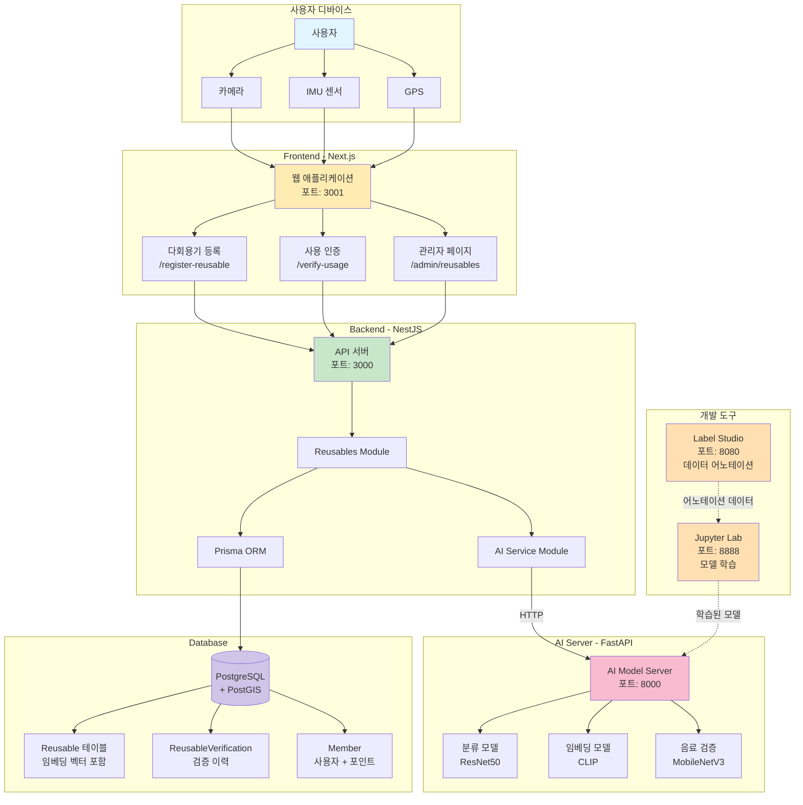
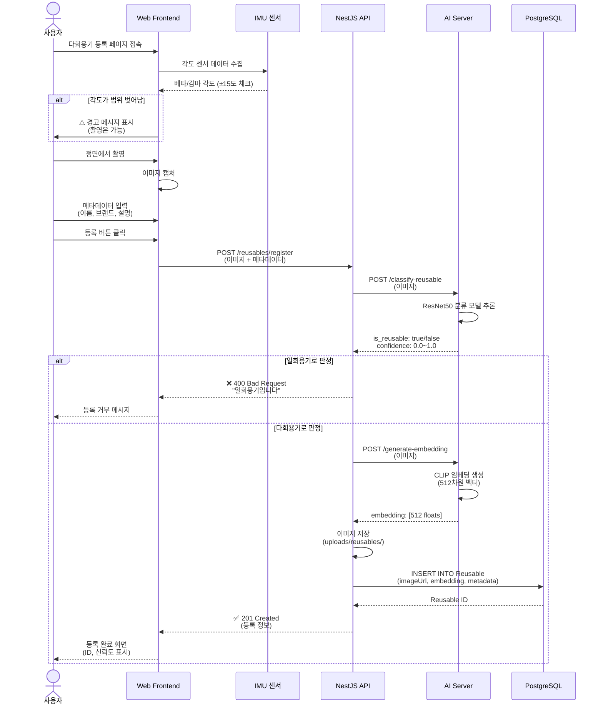
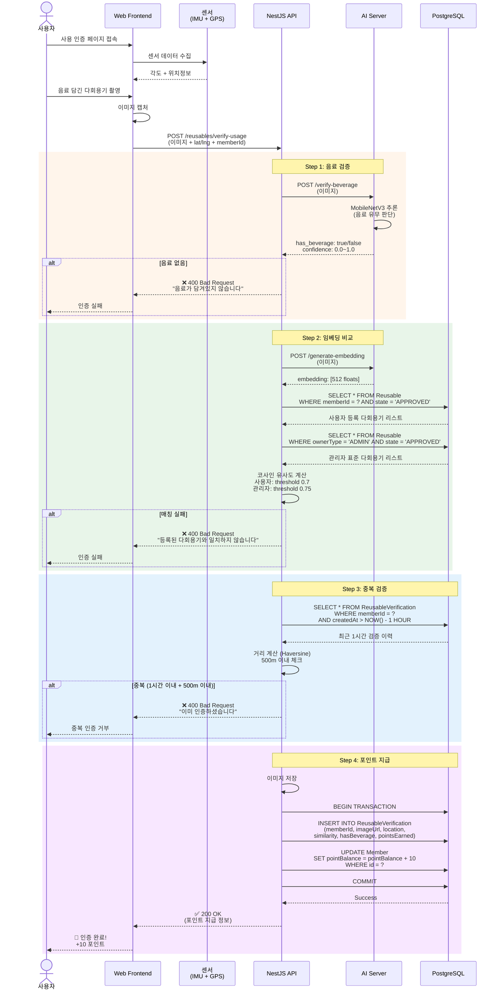
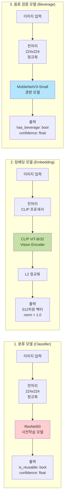
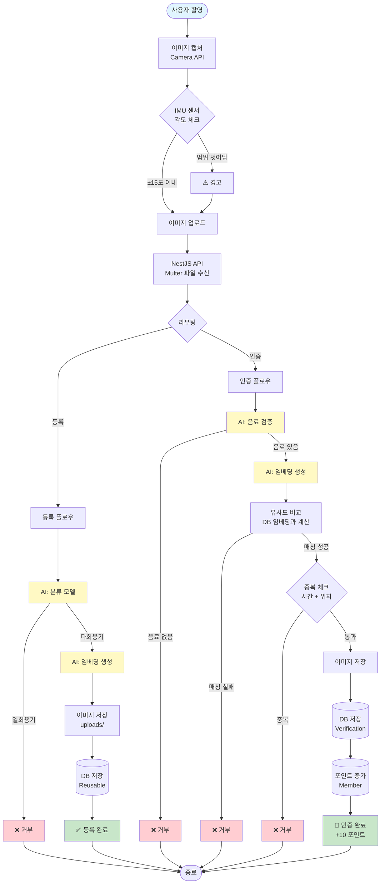
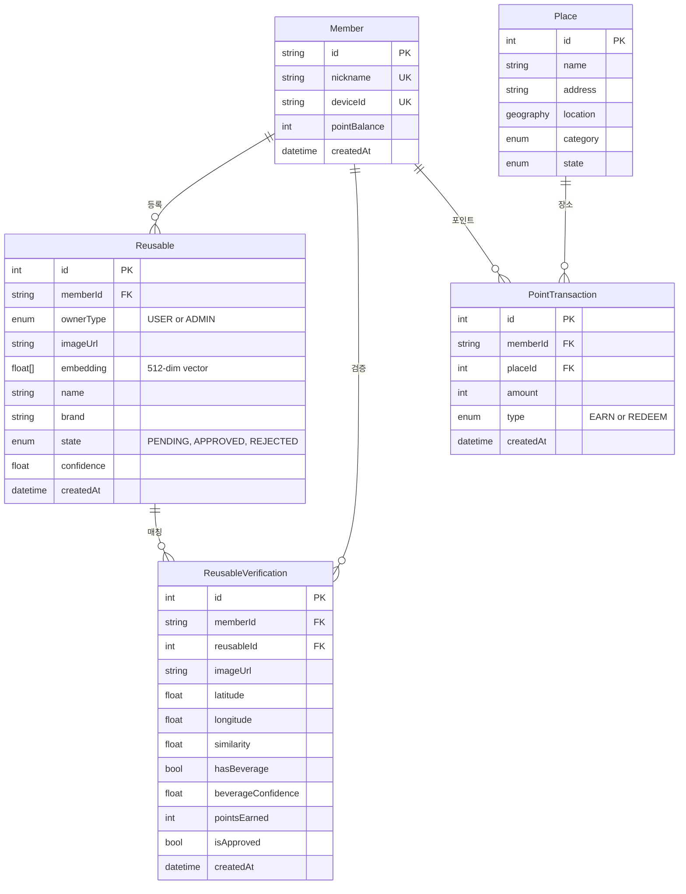
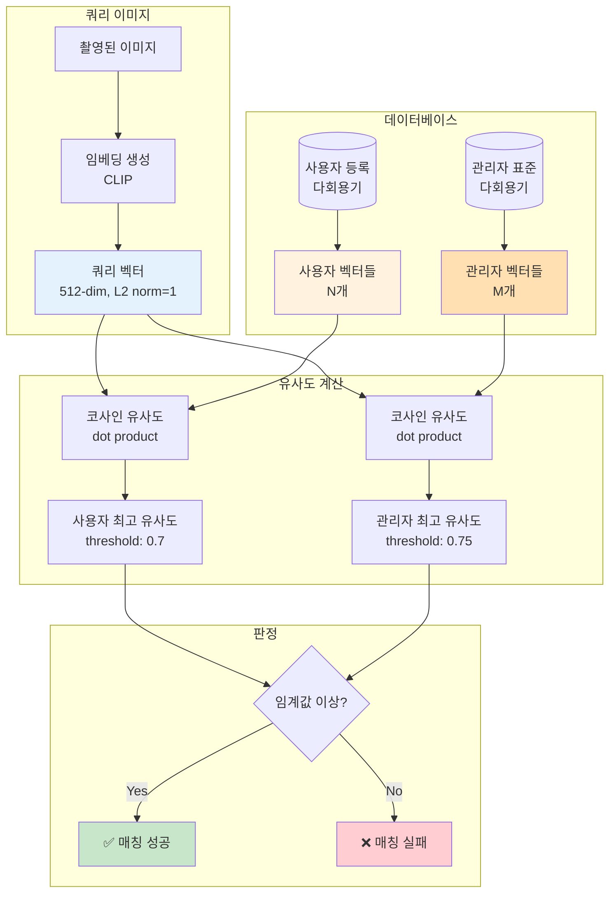
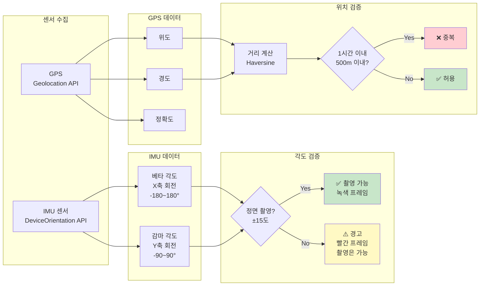
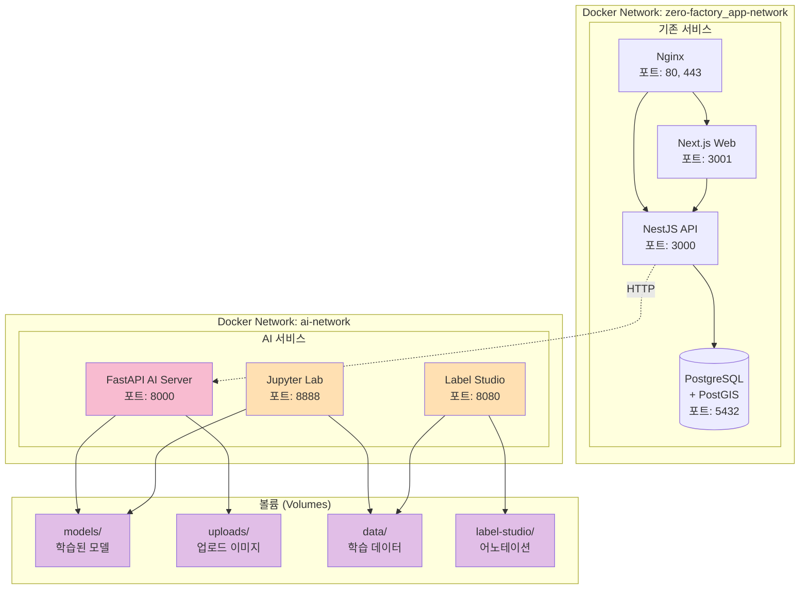
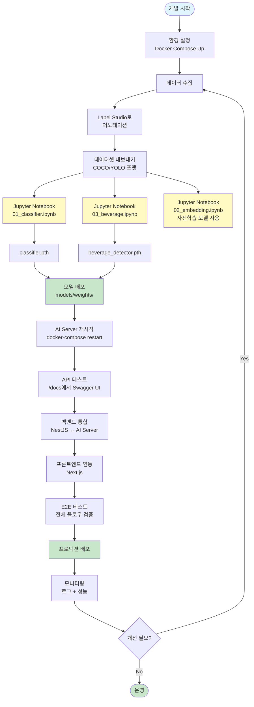

# AI 기반 다회용기 검증 시스템 - 다이어그램

## 목차
1. [시스템 아키텍처](#1-시스템-아키텍처)
2. [다회용기 등록 플로우](#2-다회용기-등록-플로우)
3. [사용 인증 플로우](#3-사용-인증-플로우)
4. [AI 모델 추론 프로세스](#4-ai-모델-추론-프로세스)
5. [데이터 흐름](#5-데이터-흐름)

---

## 1. 시스템 아키텍처

전체 시스템의 컴포넌트 구성 및 통신 방식



---

## 2. 다회용기 등록 플로우

사용자가 다회용기를 등록하는 전체 과정



---

## 3. 사용 인증 플로우

다회용기 사용을 촬영으로 검증하여 포인트를 받는 과정



---

## 4. AI 모델 추론 프로세스

각 AI 모델의 역할과 입출력



### 모델 상세 정보

| 모델 | 백본 | 입력 크기 | 출력 | 추론 속도 | 용도 |
|------|------|-----------|------|-----------|------|
| **분류** | ResNet50 | 224x224 | 2 classes | ~200ms | 다회용기 vs 일회용기 |
| **임베딩** | CLIP ViT-B/32 | 224x224 | 512-dim | ~300ms | 이미지 유사도 비교 |
| **음료** | MobileNetV3-Small | 224x224 | 2 classes | <100ms | 음료 유무 판단 |

---

## 5. 데이터 흐름

시스템 전체의 데이터 이동 경로



---

## 6. 데이터베이스 ERD

주요 테이블 간 관계



---

## 7. 임베딩 벡터 비교 프로세스

코사인 유사도 계산 방식



### 코사인 유사도 공식

L2 정규화된 벡터의 경우:
```
similarity = v1 · v2 = Σ(v1[i] * v2[i])
```

범위: -1.0 ~ 1.0 (높을수록 유사)

---

## 8. 센서 데이터 통합

IMU 센서 + GPS 활용 방식



---

## 9. Docker 컨테이너 구성

서비스 간 네트워크 및 볼륨 관계



---

## 10. 개발 워크플로우

모델 학습부터 배포까지



---

## 요약

### 핵심 플로우
1. **등록**: 촬영 → AI 분류 → 임베딩 저장
2. **인증**: 촬영 → 음료 검증 → 임베딩 비교 → 포인트 지급

### 주요 컴포넌트
- **Frontend**: Next.js (카메라, 센서)
- **Backend**: NestJS (비즈니스 로직)
- **AI Server**: FastAPI (모델 추론)
- **Database**: PostgreSQL (데이터 저장)

### 센서 활용
- **IMU**: 정면 촬영 가이드 (±15도)
- **GPS**: 중복 방지 (500m, 1시간)

### AI 모델
- **분류**: ResNet50 (다회용기 vs 일회용기)
- **임베딩**: CLIP (512차원 유사도)
- **음료**: MobileNetV3 (음료 유무)
